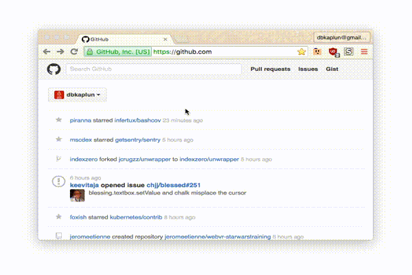

#  tabterm

What if your browser's new tab page was a terminal? Based on Chrome OS's
[hterm](https://chromium.googlesource.com/apps/libapps/+/master/hterm).



## Installation
```sh
$ brew install tabterm/taps/tabterm # homebrew formula, includes a LaunchAgent that starts tabterm on login
```
Or:
```sh
$ npm install -g tabterm # install tabterm
$ tabterm # start the daemon manually
TabTermServer started: http://127.0.0.1:7473
```

We recommend using your OS's tabterm package. If you installed tabterm via a
package and are using the package's startup script, you are set! Just visit
[localhost:7473](http://localhost:7473) and observe the shiny new terminal.
Otherwise start the daemon manually using the instructions above.


## New tab page

### Chrome

* Install [New Tab iFrame](https://chrome.google.com/webstore/detail/new-tab-iframe/pjjgnpjhedgolccfdplecmnapdjhlknm)
* Open `chrome-extension://pjjgnpjhedgolccfdplecmnapdjhlknm/options.html`
* Set the URL to `http://localhost:7473`
* Observe your new tab page is now a terminal
